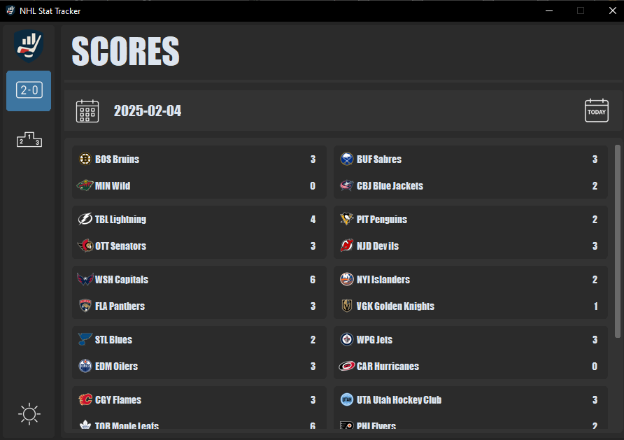
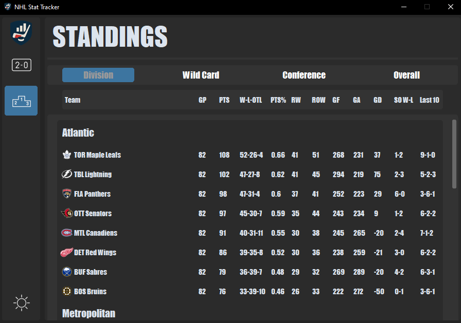

# NHL Stat Tracker 

> A simple and interactive NHL statistics tracker that lets you view games and league standings in real time.

---

## 📂 Table of Contents

- [About the Project](#about-the-project)
- [Features](#features)
- [Technologies Used](#technologies-used)
- [Screenshots](#screenshots)
- [Contact](#contact)

---

## 📌 About the Project

The NHL Stat Tracker is a python based application that pulls live and historical NHL data to give users quick insights, team standings, and game results. Whether you're a fantasy hockey fan, a data nerd, or just want to keep up with your favourite team, this tool makes it easy to access and visualize the information.
 
The NHL Stat Tracker is a personal project of mine that I enjoy working on and will continue to add features when I find the time. As of right now I am happy with the progress I have made but do have plans to add more in the future.

---

## ✨ Features

- View Live games
- View Previous games
- View Future games
- View current season standings
- Light and Dark mode

In the future I have plans to add features such as: 
- Viewing season stat leaders
- Viewing game player stats (Live and Finished)
- Adding Favourite Teams
- Notification for games

---

## 🧰 Technologies Used
 - CustomTkinter
 - SQLite

## 🖼 Screenshots
**Scores Page**  

**Standings Page** 

## 📬 Contact
**Jonathan Principato**
- Email: [jonathan.principato@gmail.com](jonathan.principato@gmail.com)
- GitHub: [@jprincip21](https://github.com/jprincip21)

